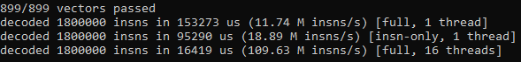
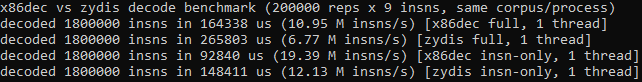

# x86-64-decoder - fast x86-64 instruction decoder in C

i wanted a small instruction decoder i fully understand instead of pulling in a big dependency every time i need a length, a mnemonic, or an operand breakdown. so i built x86dec, a table-driven x86-64 decoder in C17 with no dependencies.

## what is this?

x86dec decodes x86-64 (and 32-bit legacy mode) instruction bytes into mnemonic, length, operand widths, registers, memory operands (base/index/scale/displacement/segment), and immediates, plus an intel-style text formatter.

the api is split on purpose: `x86dec_decode_insn` gives you length + mnemonic without touching operands, and `x86dec_decode_full` gives you insn + decoded operands. length-only scanning is roughly 1.6x faster (see benchmark).

key features:
- **split decode api** — length/mnemonic path (`decode_insn`) vs full path (`decode_full`), so hot loops that only need boundaries don't pay for operand decoding
- **899 test vectors** — every supported encoding has a bytes → mnemonic/length/text vector, run on every build; the binary exits nonzero on any failure
- **broad isa coverage** — legacy GPR/ALU/`Jcc`/`CMOVcc`/`SETcc`/string/`IN`/`OUT`, x87 FPU, 3DNow!, MMX/SSE through SSE4, AES-NI/`PCLMULQDQ`/SHA/`CRC32`, SVM, CET shadow-stack pieces, and VEX-encoded AVX/AVX2/BMI1/BMI2/FMA/F16C with XMM/YMM
- **thread-safe by construction** — all tables are `const`, all per-decode state lives on the caller's stack, no locks, no globals, no heap in the hot path; the test binary ships single-threaded and multi-threaded benches
- **perf-focused** — single unity build for cross-file inlining, `restrict` on hot apis, 256-byte prefix lookup table, branch hints for hot/cold paths, no redundant copies on the legacy path

## screenshots



*`build\x86dec.exe`: 899/899 vectors passed, then the three built-in benches (full and length-only single-threaded, plus multi-threaded full decode)*



*`build\x86dec-bench-zydis.exe`: same corpus, same process, x86dec vs vendored Zydis on full-operand and length-only paths*

## how it works

1. **prefix scan** — consumes legacy prefixes (`F0`/`F2`/`F3`/segment/`66`/`67`) via a 256-entry lookup table into `X86decRaw`
2. **REX** — one branch for `0x40-0x4F` in 64-bit mode, sets the effective operand size
3. **opcode + map** — `0F` escapes to maps 1 (`0F`), 2 (`0F38`), 3 (`0F3A`); `C4`/`C5` go to the VEX front-end (`R`/`X`/`B`/`W`/`vvvv`/`L`/`pp`), `0x62` (EVEX) currently returns `UNSUPPORTED`
4. **tail scan** — ModRM/SIB/displacement bytes, shared by all maps
5. **table resolve** — direct maps, opcode groups (`Group 1/2/3/4/5/7/8/9/11/15`), SSE prefix variants (`66`/`F3`/`F2`), crypto (`0F38`/`0F3A`), and FPU escapes (`D8-DF`)
6. **operands** — shapes (`GPR`/`XMM`/`YMM`/`MEM`/`IMM`/`REL`/`MOFFS`/`ST`) become registers (with `REX`/`VEX` extension), memory (`base+index*scale+disp`, segment defaults to `SS` for `SP`/`BP`), and immediates (sign-extended where the encoding requires it)

## project structure

```
x86-64-decoder/
├── CMakeLists.txt               # build config (clang-cl + ninja, /O2)
├── CMakePresets.json            # windows release preset, output goes to build/
├── build.bat                    # configure + build script
├── README.md
├── include/x86dec/
│   ├── x86dec.h                 # public umbrella header
│   ├── core/
│   │   ├── types.h              # status/mode enums, likely/unlikely helpers
│   │   ├── mnemonic.h           # mnemonic enum
│   │   ├── register.h           # register enum (GPR/XMM/YMM/ZMM/opmask)
│   │   └── operand.h            # operand/mem structs
│   ├── decode/
│   │   └── decoder.h            # decoder + insn/context structs, decode api
│   └── format/
│       └── formatter.h          # text formatter api
├── src/
│   ├── main.c                   # test runner (899 vectors) + 3 benches
│   ├── decode/
│   │   ├── decoder.c            # prefix/rex/opcode/tail/resolve/imm driver
│   │   ├── prefix.c             # legacy prefix lookup table
│   │   ├── mem.c                # modrm/sib/displacement tail scan
│   │   ├── operands.c           # shape -> operand builder
│   │   ├── vex.c / vex.h        # VEX front-end (R/X/B/W/vvvv/L/pp + validation)
│   │   ├── tables.h / scan.h    # entry/shape/group/fx definitions, cursor
│   │   ├── table_legacy.c       # map 0 (00-FF)
│   │   ├── table_0f.c           # map 1 (0F xx)
│   │   ├── table_groups.c       # opcode groups + mode-dependent fixups
│   │   ├── table_fpu.c          # FPU escapes D8-DB
│   │   ├── table_fpu2.c         # FPU escapes DC-DF
│   │   ├── table_3dnow.c        # 0F 0F tail-byte table
│   │   ├── table_sse.c          # SSE variant picker + shifts/movdq/PINSRW-PEXTRW
│   │   ├── table_sse_mov.c      # SSE moves
│   │   ├── table_sse_alu.c      # SSE alu (incl. UNPCKLPS/UNPCKHPD)
│   │   ├── table_0f38_legacy.c  # SSSE3/SSE4.1/SSE4.2 (+MOVBE via crypto)
│   │   ├── table_0f3a_legacy.c  # SSE4 blends/rounds/inserts/extracts
│   │   ├── table_crypto.c       # AES/SHA/CRC32/MOVBE/WRSSD-CET routing
│   │   └── table_vex.c          # AVX/AVX2/BMI/FMA/F16C VEX tables
│   ├── format/
│   │   └── formatter.c          # mnemonic/register text + intel formatting
│   └── test/
│       ├── vectors.h            # vector struct
│       └── vectors_ext.c        # extended vectors (FPU/SSE/VEX/...)
├── bench/
│   └── bench_zydis.c            # head-to-head benchmark vs Zydis, same corpus
└── vendor/
    └── zydis/                   # amalgamated Zydis (benchmark reference only)
```

## benchmark

`bench/bench_zydis.c` decodes the same 30-byte function prologue corpus (9 insns: `mov`/`sub`/`imul`/`call`/`ret`/`nop`/multibyte `nop`) with both decoders, back to back in one process: 200000 reps x 9 insns = 1.8M decodes each, `QueryPerformanceCounter` timing, 2000 untimed warmup reps so icache and branch predictors settle. both sides decode full operands into 10 slots; the insn-only rows use `ZydisDecoderDecodeInstruction(NULL ctx)` vs `x86dec_decode_insn(NULL ctx)`. the binary exits nonzero if any decode fails or any count != 1.8M.

run it with:

```cmd
build\x86dec-bench-zydis.exe
```

measured on this machine (clang-cl `/O2`, Windows x64):

| decoder | mode | M insns/s |
|---|---|---|
| x86dec | full (insn + operands) | ~11.7 |
| zydis | full (insn + operands) | ~6.8 |
| x86dec | insn-only (length + mnemonic) | ~18.9 |
| zydis | insn-only (length + mnemonic) | ~12.1 |

so roughly 1.6-1.7x on both paths on this corpus. `build\x86dec.exe` also prints the project's own benches, including a length-only single-thread run (~18.9M) and a multi-threaded full-decode run (~98-110M aggregate on 16 logical processors, same corpus replicated per thread, no shared mutable state).

fairness notes, read before quoting numbers elsewhere:
- same corpus, same rep count, same process, same flags (`/O2`), back-to-back
- zydis is the complete decoder here: full AVX512/EVEX, formatter, and operand detail i don't implement. x86dec wins on this corpus because its tables are tiny (legacy + SSE/VEX subset, everything `const`, hot path is a few table lookups) while zydis pays for generality
- the corpus is legacy-heavy (`mov`/`sub`/`imul`/`call`/`ret`/`nop`) with zero VEX/EVEX bytes, which favors table-driven decoders. on AVX512-heavy input the comparison would look different since x86dec returns `UNSUPPORTED` for EVEX

## prerequisites

- **Windows x64**
- **LLVM clang-cl** on `PATH` (or set `LLVM_ROOT`), e.g. `C:/Program Files/LLVM/bin`
- **CMake** (3.21+)
- **Ninja** (comes with Visual Studio or standalone)

note: the Visual Studio generator is explicitly rejected by `CMakeLists.txt`. use the preset (Ninja + clang-cl).

## building

```cmd
build.bat
```

this configures with the `windows` preset if needed and builds everything. output goes to `build/`:
- `build\x86dec.exe` - test runner (899 vectors) + single/multi-threaded benches
- `build\x86dec-bench-zydis.exe` - head-to-head benchmark vs vendored Zydis

## usage

run the tests (exits nonzero on any failure, then prints the three bench lines):

```cmd
build\x86dec.exe
```

run the comparison:

```cmd
build\x86dec-bench-zydis.exe
```

minimal library usage:

```c
#include "x86dec.h"

X86decDecoder dec;
X86decInsn insn;
X86decOperand ops[X86DEC_MAX_OPERANDS];
char text[160];

x86dec_decoder_init(&dec, X86DEC_MODE_LONG_64, X86DEC_STACK_64);

if (x86dec_decode_full(&dec, bytes, len, &insn, ops, X86DEC_MAX_OPERANDS) == X86DEC_OK) {
    x86dec_format_insn(&insn, ops, text, sizeof(text));
    printf("%s len=%u\n", text, insn.length);
}
```

use `x86dec_decode_insn(&dec, NULL, bytes, len, &insn)` when you only need length + `x86dec_mnemonic_text(insn.mnemonic)`. share one `const X86decDecoder*` across threads; give each thread its own `X86decContext`/`X86decInsn`/operand array.

## notes

- this is a learning project. the code prioritizes small tables and a fast legacy path over completeness
- EVEX (`0x62` prefix, AVX512) returns `X86DEC_UNSUPPORTED`. the register file already reserves `ZMM`/`K` names for when it lands
- AMD XOP is unsupported (reports `X86DEC_UNSUPPORTED`, covered by vectors)
- 32-bit legacy mode decodes through the same tables with `X86DEC_MODE_LEGACY_32` and is covered by its own vectors
- `vendor/zydis` is only used by the comparison benchmark, never by the library itself
- tested on Windows 11 x64 with LLVM clang-cl

## what i learned

- table-driven decoding stays fast when the hot path is just prefix → map → ModRM tail → one resolve; every branch you add there shows up directly in M insns/s
- always zero-initialize resolver outputs: an uninitialized `is_vex` on the `0F38`/`0F3A`/FPU paths once made REX.W `MOVBE` decode its destination as 32-bit next to a correct 64-bit memory operand, depending on stack garbage
- VEX's second source (`vvvv`, inverted) and `L` (128 vs 256) belong in the operand builder, not the tables — the tables stay small and `L` just selects XMM vs YMM
- `restrict` on hot apis, one unity build for cross-file inlining, and a 256-byte prefix table beat clever per-opcode tricks
- benchmarking decoders fairly means same corpus, same rep count, same process, warmup discarded, and reporting both full-operand and length-only paths
